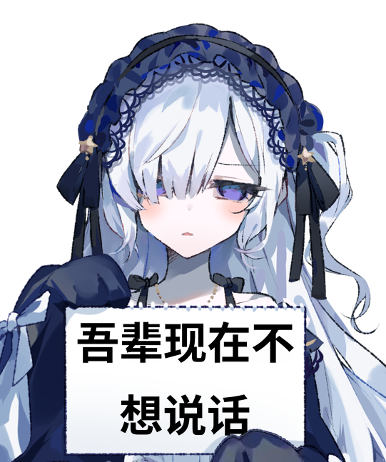
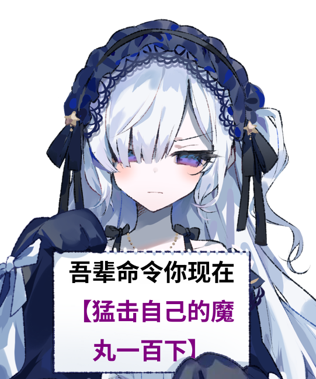
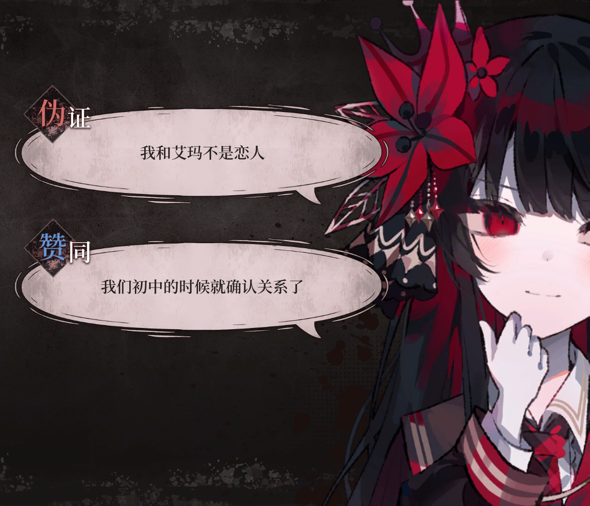
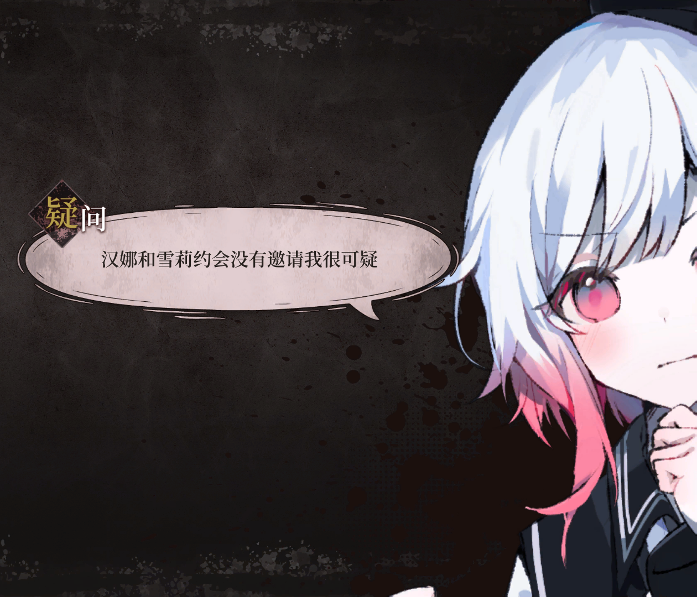

  

# nonebot-plugin-manosaba-memes

_✨ [NoneBot2](https://github.com/nonebot/nonebot2) 魔法少女的魔女审判表情包生成插件 ✨_

  
  
  

~~[#まのさばネタバレ](https://manosaba.com)~~

## 介绍

`nonebot-plugin-manosaba-memes` 是一个用于生成与游戏「魔法少女的魔女审判」相关的表情包的插件。还在开发中，有好的想法欢迎提 Issue 哦～

## 功能

### 安安说

让不同表情的安安举着写了你想说的话的素描本

**格式**: 安安说 [文本] [表情]

| 示例 1 | 示例 2 |
| :---: | :---: |
| 安安说 吾辈现在不想说话 | 安安说 吾辈命令你现在【猛击自己的魔丸一百下】 生气 |
|  |  |

**注意**:
1. 可用表情有：害羞, 生气, 病娇, 无语, 开心
2. 中括号中的内容会被渲染成紫色
3. 可以在文本中输入“\n”进行换行，也可以使用半角双引号包裹住文本内容后直接进行换行

### 我当时睡的可香了

生成审判时的选项图片

**格式**: 【疑问/反驳/伪证/赞同】[文本]

| 示例 1 | 示例 2 |
| :---: | :---: |
| 【伪证】我和艾玛不是恋人 【赞同】我们初中的时候就确认关系了 | 【疑问】汉娜和雪莉约会没有邀请我很可疑 |
|  |  |

**注意**:
1. 使用 `切换角色 [艾玛/希罗]` 可以切换角色，角色与用户绑定
2. 多行文本会被识别为多条选项。选项数量没有上限，但 3 条以内效果最佳

## 安装

使用 nb-cli 安装

在 NoneBot2 项目的根目录下打开命令行, 输入以下指令即可安装

    nb plugin install nonebot-plugin-manosaba-memes

使用包管理器安装

在 NoneBot2 项目的插件目录下, 打开命令行, 根据你使用的包管理器, 输入相应的安装命令

pip

    pip install nonebot-plugin-manosaba-memes

pdm

    pdm add nonebot-plugin-manosaba-memes

poetry

    poetry add nonebot-plugin-manosaba-memes

conda

    conda install nonebot-plugin-manosaba-memes

打开 NoneBot2 项目根目录下的 `pyproject.toml` 文件, 在 `[tool.nonebot]` 部分追加写入

    plugins = ["nonebot_plugin_manosaba_memes"]

## 致谢

- 感谢 [TY_Ling](https://github.com/YoisakiKnd) 提出了写这个插件的想法（其实一开始是他开始写的不过被我抢过来了w）
- 感谢 [Mythos_404](https://github.com/Mythos-404) 编写了高效又好用的绘图库 [sketchbook-py](https://pypi.org/project/sketchbook-py/)
- 感谢 Acacia 制作了魔法少女ノ魔女裁判，第一个能让我玩到凌晨四点的游戏
